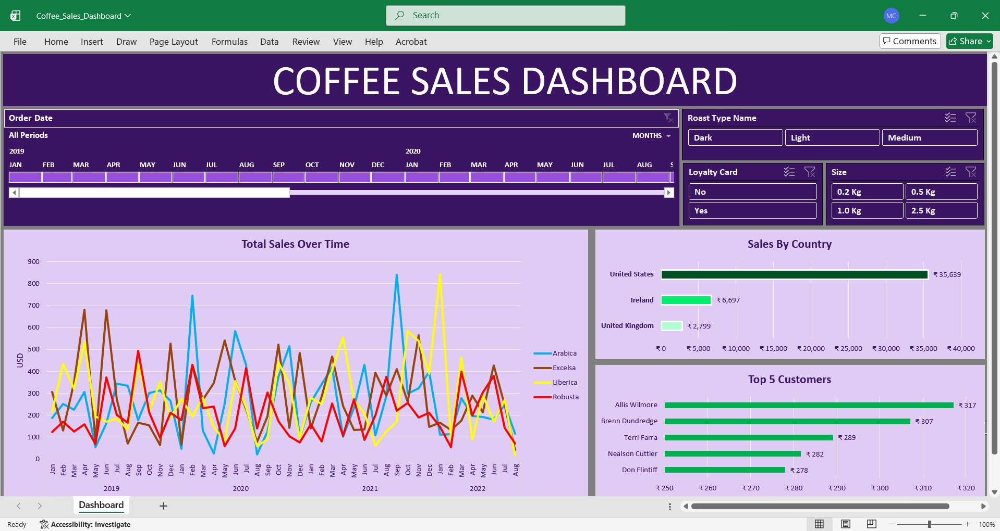

# Coffee-Sales-Dashboard

## Project Overview
This project analyzes coffee sales data to understand product performance, customer behaviour, and country-wise sales trend using Excel to provide a clear business insight.

## Objective
* Analyse Total Sales By Country
* Identify Top 5 Customers
* Analyse Sales Trend Over Time
* Understand product demand by coffee type and roast

## About the Dataset
The datase consists of the following sheets:
* orders: Where all the order sales-Transaction have been recorded includind Order-ID, Order Date, Customer Name, Product-ID, Quantity, Unit price, Sales.
* customers: details of customers including customer id, customer name, email, Phone number, Address, City, Country.
* products: Here, all the details of the products have been recorded including Product ID, Coffee Type, Roast Type, size, Unit Price.

## Key Fields
* Order Date
* Country
* Coffee Type & Roast Type
* Quantity, Unit Price, Sales
* Customer ID, Product ID

## Tools and Techniques
* Microsoft Excel
* Pivot Table & Pivot Charts
* Lookup Functions (for mapping data across sheets)
* Slicers for filtering data
* Dashboard design & formatting

## Dashboard Features
* Total Sales Over Time
* Sales By Country
* Top 5 Customers
* Interactive filters for coffee type, roast type and size

## Key Insights

* The United States contributes the highest overall sales among all countries.
* A small group of repeat customers accounts for a significant portion of total revenue.
* Medium and light roast coffee types show stronger demand compared to darker roasts.
* Customers with loyalty cards tend to place higher-value orders.

## Dashboard Preview

## Conclusion
This analysis highlights key revenue drivers in coffee sales and demonstrates how Excel can be used effectively for end-to-end data analysis and dashboarding. The insights can help businesses focus on high-performing markets, products, and customer segments.

